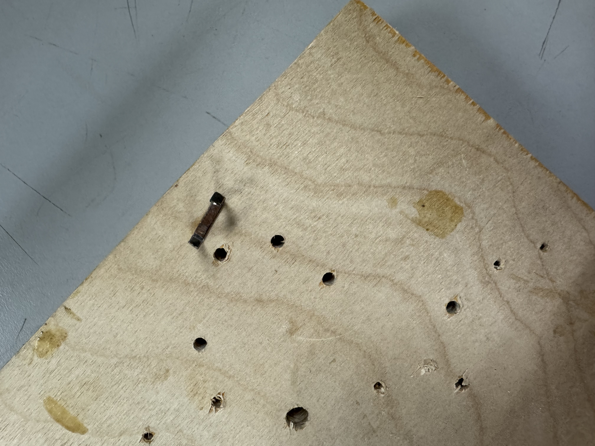

## Introduction

I've been designing and building a multi-stage railgun to explore electromagnetic propulsion. 
The project involves coil arrangement, projectile design, and high-voltage testing.

### Early Stage Assembly

Discuss the coil arrangement, design tools used, etc.

### Final Stage Tests

Here are some final test images:

*(We used a 500V capacitor bank, measuring projectile velocity...)*

### Final Stage MP4 Video

Below is a local `.mp4`:

<video width="560" height="315" controls>
  <source src="./images/Final%20Stage/IMG_4984.mp4" type="video/mp4" />
  Your browser does not support the video tag.
</video>

*(This clip shows the final test firing with improved coil geometry.)*

### Next Steps

Additional refinements: better projectile materials, more robust housing, further simulation in ANSYS EM...
